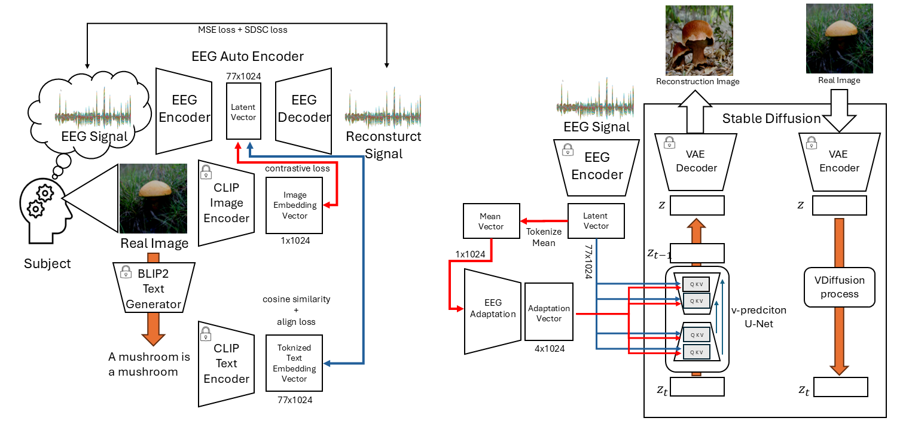
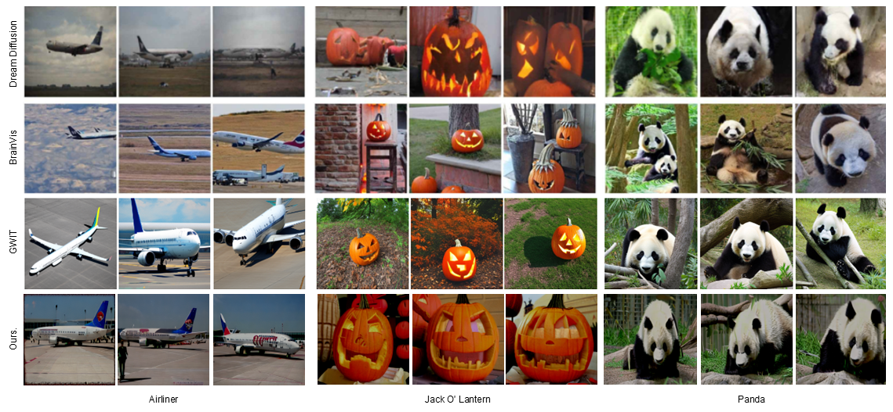

# SYNAPSE: Synergizing an Adapter and Finetuning for High-Fidelity EEG Synthesis from a CLIP-Aligned Encoder

<!-- 
<p align="center">
<a href="https://ign0relee.github.io/sdsc" style="text-decoration: none;">

</a>
<a href="." style="text-decoration: none;">

</a>
<a href="https://arxiv.org/abs/2507.14516" style="text-decoration: none;">

</a>   
</p> -->

<center>

__Fig. main model__

</center>
SYNAPSE is an efficient two-stage framework for high-fidelity, multi-subject EEG-to-Image synthesis, which uses a pre-trained, CLIP-aligned autoencoder to condition Stable Diffusion via a lightweight adaptation module.

## Highlights

- State-of-the-Art (SOTA) FID: Achieves a SOTA FID score of 46.91 in the challenging multi-subject CVPR40 setting, a nearly 2x improvement over the previous SOTA (GWIT, 80.47).


- High Efficiency: Uses the fewest total trainable parameters (152.69M) compared to all recent baselines (DreamDiffusion, 210M; BrainVis, 195M; GWIT, 368M), enabling the entire pipeline to be trained on a single consumer GPU (RTX 3090).

- Direct Alignment Framework: Proposes a novel hybrid autoencoder that is pre-trained to directly align EEG signals with the CLIP embedding space , eliminating the need for complex, indirect classification or separate mapping networks  used in prior work.

## Main Results

<center>

__Fig. Compare with Others__

</center>


<center>

__Fig. Semantcial Results__

</center>


Baseline Code : [LINK](https://github.com/bbaaii/DreamDiffusion)


## Run SYNAPSE Framework


### Building Enviroment
```cmd
conda create --name=synapse python=3.10
conda activate synapse
```


```cmd
pip install -r requirements.txt
```

### Get Started

1. Dataset Download [LINK](https://github.com/perceivelab/eeg_visual_classification)
2. And Run preprocessing.ipynb files : [LINK](./src/preprocessing.ipynb)


### Pretrained Models
Pretrian Ecnoder: [LINK](https://drive.google.com/drive/folders/1aQe2bxIijPKFn0fYnp-TnmjTVZCfi_T-?usp=drive_link)
Ptretrain LDM   : [Multi-Subject](https://drive.google.com/drive/folders/1OiqY7LaendDlVfhme5BECf0LYVVXlieg?usp=drive_link), [Subject-4](https://drive.google.com/drive/folders/178ZbHqGBpZWGOXDtF1hKvmpJq2HB_XoN?usp=drive_link)

### Gen Images
```cmd
python gen_images.py
```

### Test Output
1. Run MAKE IS Dataset.ipynb : [LINK](./src/Make%20IS%20Dataset.ipynb)

2. Run test_images.py
```cmd
python test_images.py
```

3. Run test_IS.py
```cmd
python test_IS.py
```


## From Scratch
We support only ddp modes now(because of stability of codes)

### Stage1
1. set the config, named Train_AE.json[LINK](./src/config/Train_AE.json)

2. run from scratch
```python
train_ae.py
```

### Stage2
1. set the config, named Train_LDM.json [LINK](./src/config/Train_LDM.json)


2. run from scratch
```python
train_ldm.py
```


## Citation
Not ready yet
<!-- 
## Contact
If you have any questions, please contact dlwpdud@catholic.ac.kr -->

## Acknowledgement

## Star History
<iframe style="width:100%;height:auto;min-width:600px;min-height:400px;" src="https://www.star-history.com/embed?secret=#CVMILab-CUK/synapse&type=date&legend=top-left" frameBorder="0"></iframe>